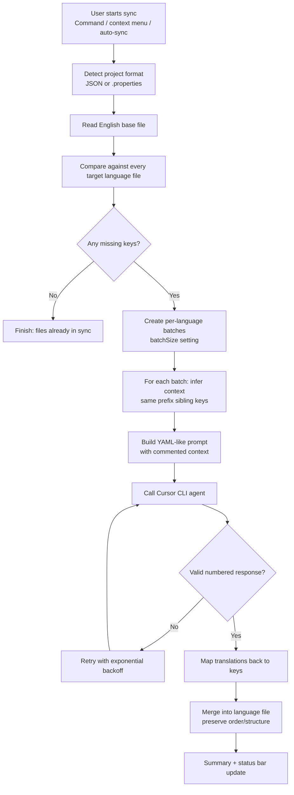
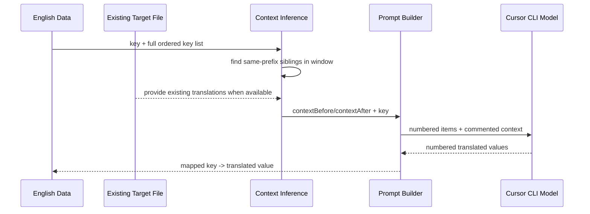
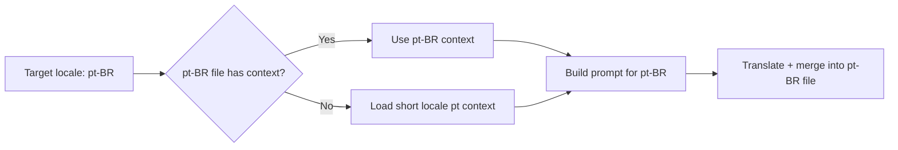

# i18n Sync Translations - End-to-End Flow Guide

This guide explains how the extension works from click to final translated files, in language that is friendly to non-technical teams while still covering the technical details your Translation team needs.

---

## 1) What this tool does in one sentence

The extension compares English source keys to every target language file, finds only missing translations, sends those missing strings to the Cursor CLI with contextual hints, then writes translated keys back without overwriting existing translations.

---

## 2) Full workflow at a glance



---

## 3) Step-by-step (plain language)

### Step 1 - A sync starts

A sync starts from one of these triggers:
- `i18n: Sync Translations` command
- Right-click context menu on an i18n base file
- Status bar click
- Auto-sync watcher (after debounce timer)

### Step 2 - The tool detects your i18n format

It inspects the folder:
- If `i18n-en.json` exists -> JSON mode
- If `Messages.properties` exists -> Java properties mode

### Step 3 - It identifies missing keys only

The extension reads English keys and compares them with each language file:
- Existing translations are kept
- Only missing key/value pairs are queued for translation

### Step 4 - Missing strings are chunked into batches

Batches are created per language using settings:
- `batchSize` controls keys per API call
- `concurrentLimit` controls how many batches run in parallel

### Step 5 - Context inference enriches each key

Before sending a batch to the model, the extension adds context for each key:
- Finds sibling keys with the same prefix (for example `checkout.payment.*`)
- Uses nearby keys before/after in source order
- Prefers existing target-language values as context
- Falls back to English context if target values are missing
- Excludes keys that are in the current batch (so context stays "already translated" references)

### Step 6 - Prompt is built and sent to Cursor CLI

Prompt format:
- Sectioned by key prefix
- Context included as comment lines (`# ...`)
- Keys to translate as numbered items
- Strong output rule: return only `N. translated value`

The extension invokes Cursor CLI with:
- `cursor agent --print --force --output-format text`
- Optional `--model <modelName>` from settings

### Step 7 - Response is validated and normalized

The extension parses numbered lines, checks counts, and sanitizes values:
- Ensures number of outputs == number of input keys
- Handles model echo patterns like `key: "translated"` and unwraps quotes safely

### Step 8 - Retry logic handles temporary failures

For transient issues, it retries with exponential backoff:
- Attempt delays: 2s, 4s, 8s... (based on `maxRetries`)
- Quota exhaustion is treated as fatal (stop and report)
- Cancellation is supported

### Step 9 - Results are merged to files safely

Merge behavior:
- JSON: preserve English key order
- `.properties`: preserve existing structure/comments where possible
- Existing keys are not overwritten by this missing-key flow

---

## 4) Context inference deep dive (technical perspective)

Context inference is implemented to improve translation consistency, not just literal accuracy.

### 4.1 Prefix-based grouping

Each key is split by `.`.  
Example:
- `settings.agreements.select_file`
- Prefix: `settings.agreements`

Sibling selection only considers keys with the same prefix (unless key has no prefix, then root behavior applies).

### 4.2 Windowed sibling search

For each key, the engine scans neighboring keys in the ordered English file:
- up to `contextWindowSize` before
- up to `contextWindowSize` after

This captures local terminology used around the same UI/domain area.

### 4.3 Context value source priority

When a sibling key is chosen:
1. Use existing target-language translation if available
2. Else use English value

This keeps tone and vocabulary aligned with what translators already approved in that language.

### 4.4 Long locale fallback

For long locales (like `pt-BR`, `es-419`, `zh-Hans`):
- if direct locale file is empty/missing for context
- fallback to short locale (`pt`, `es`, `zh`) context file

This is context fallback only; translation output still targets the requested long locale code.

### 4.5 Prompt representation

Context lines are included as comments, not active translation items:
- `# Context ... DO NOT translate these`
- Numbered lines contain only keys that must be translated

This strongly separates "reference memory" from "required output".



---

## 5) Three concrete translation examples

## Example 1 - Button label in checkout flow

### Input situation
- Missing key in `i18n-es.json`:
  - `checkout.payment.submit = "Pay now"`
- Existing sibling translations in Spanish:
  - `checkout.payment.title = "Pago"`
  - `checkout.payment.saved_card = "Tarjeta guardada"`
  - `checkout.payment.processing = "Procesando pago..."`

### Context effect
The model sees payment-domain context and usually picks the action-oriented UI wording:
- Output likely: `"Pagar ahora"`

Without context, it may choose less UI-consistent variants.

## Example 2 - Legal wording consistency

### Input situation
- Missing key in `i18n-de.json`:
  - `settings.agreements.accept_terms = "Accept terms"`
- Existing sibling context in German:
  - `settings.agreements.title = "Vereinbarungen"`
  - `settings.agreements.download_document = "Dokument herunterladen"`
  - `settings.agreements.replace = "Ersetzen"`

### Context effect
Because this is in the agreements/legal cluster, wording tends to stay formal:
- Output likely: `"Bedingungen akzeptieren"`

Context avoids overly casual variants.

## Example 3 - Long locale fallback (`pt-BR` using `pt`)

### Input situation
- Translating `i18n-pt-BR.json` for first time
- `i18n-pt-BR.json` has little/no existing data
- `i18n-pt.json` has mature glossary
- Missing key:
  - `profile.notifications.muted = "Muted"`

### Context effect
The engine loads `pt` as context fallback for better terminology continuity, while still targeting `pt-BR`.

Potential output (example):
- `"Silenciadas"`

Why this wording is better here:
- The key namespace includes `notifications`, so a plural/feminine adjective in pt-BR can be more natural than a generic singular label.

This reduces "cold start" inconsistency for newly introduced long-locale files.



---

## 6) Reliability and quality controls

- Strict output format parsing (`N. ...`)
- Count validation between input keys and output lines
- Retry with backoff for transient failures
- Timeout protection for CLI calls
- Safe merge that does not replace existing translated keys in missing-key flow
- Optional debug mode for prompt/response diagnostics

---

## 7) What Translation team members should monitor

- Keep `translationTone` aligned with brand style
- Keep `contextWindowSize` at a practical range (typically 3-7)
- Review newly generated translations for high-visibility/legal strings
- Ensure chosen model is the one approved by your team policy

---

## 8) Verification

The repository ships with a regression harness in `test-app/` that
exercises the entire flow above against a small fixture (16 keys × 4
languages). The fixture's locale files are treated as the source of
truth; the test deletes a controlled set of keys, lets the extension
re-translate them via the real Cursor CLI + gemini-3-flash, then scores
the AI output against the original.

```bash
cd test-app
npm install        # one-time
npm run i18n:e2e   # ~50s wall time
```

What it checks:

- `findMissingKeys` correctly identifies the deleted keys per language
- Batches are created and dispatched without failure
- Every `{placeholder}` in the source is preserved in the output
- Every HTML tag (`<strong>`, `<em>`) is preserved
- Key order in the merged file matches the English source
- Existing translations are never overwritten

What it does NOT enforce as failure:

- Synonym choice (`Consultar` vs `Ver`) - both are correct Spanish
- Idiom upgrades (e.g. French `24/7` -> `24h/24, 7j/7`)
- Typography choices (Chinese full-width parens vs ASCII parens)
- Brand-name preservation (the prompt deliberately keeps "Standard",
  "Penthouse Suite" etc. untranslated)

These differences are reported but do not fail the run. Structural
integrity is the hard pass/fail bar. Run before any release of the
extension and after any prompt change in `src/contextInference.ts`.

---

## 9) Quick glossary

- **Missing key**: Key present in English source but absent in a target language file
- **Prefix**: Dot-path namespace before final segment (`checkout.payment`)
- **Sibling key**: Key with same prefix in nearby source order
- **Batch**: Group of missing keys translated in one CLI call
- **Context fallback**: Using short locale context (for example `pt`) when long locale context (`pt-BR`) is unavailable

